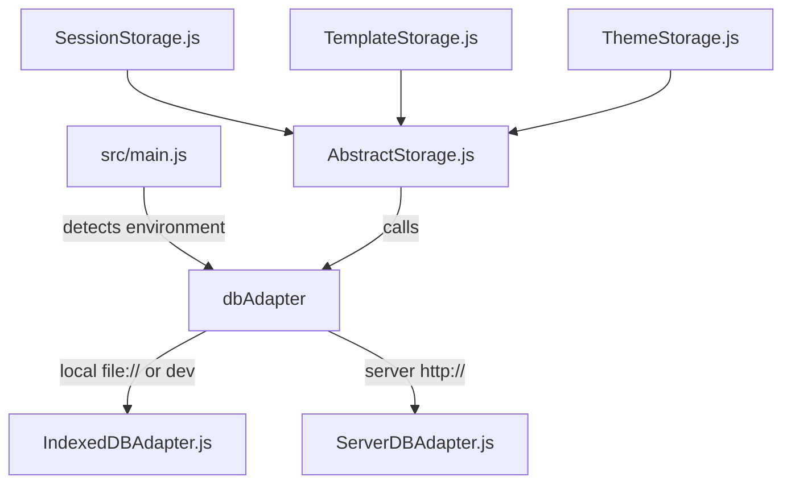

# Mikupad

## Project Overview
Mikupad is a web-based AI text generation interface. It serves as a high-fidelity frontend client to interact with various local and remote LLM APIs, including llama.cpp, KoboldCPP, OpenAI-compatible APIs, and AI Horde.

The application features full local browser persistence via IndexedDB or central centralized SQLite storage using an optional backend server. It supports rich features such as prompt templates, dynamic CSS themes, markdown previews, text-to-speech synthesis (TTS), token counts, interactive log-probability overlays, and a dedicated modal for session management with search and metadata-based sorting.

---

## Technology Stack

### Frontend
* **Core Framework**: React 19.
* **JSX-less Templates**: Built using `htm/react` (`import { html } from 'htm/react'`) to define React components using tagged template literals instead of a JSX build step.
* **Bundler & Dev Server**: Parcel.
* **Markdown Renderer**: `marked`.
* **State Management**: React Context (`SettingsContext` & `GenerationContext`).
* **Styling**: Standard vanilla CSS split into 18 partial files under `src/css/` (imported via `src/styles.css`), with dynamic theme swapping via a custom CSS injector element.

### Backend (Optional)
* **Runtime**: Node.js & Express.
* **Database**: SQLite3 with the `sqlite-zstd` extension for transparent row-level compression.
* **HTTP Client**: Axios (used for server-side proxy requests).

---

## Project Structure & Key Directories

```
mikupad/
├── dist/                          # Parcel build output (production bundle)
├── mikupad.html                   # HTML entry point (loads src/main.js as module)
├── package.json                   # Frontend dependencies and run scripts
├── server/                        # Node.js backend server
│   ├── libsqlite_zstd.so          # Precompiled sqlite-zstd shared library for Linux
│   ├── server.js                  # Main Express app and database management logic
│   ├── package.json               # Backend dependencies
│   ├── start.sh / start.bat       # Startup scripts
│   └── web-session-storage.db     # SQLite storage file (auto-generated)
└── src/                           # Frontend React source code
    ├── App.js                     # Root component orchestrating providers
    ├── AppLayout.js               # Core app shell and layout setup
    ├── main.js                    # Entry point; detects database adapter and renders
    ├── api/                       # API modules for backends (llama.cpp, Horde, OpenAI, etc.)
    ├── components/                # React components (Modals, Sidebar, controls, icons)
    ├── contexts/                  # SettingsContext and GenerationContext
    ├── css/                       # CSS partials (18 files, imported by styles.css)
    ├── defaults/                  # Hardcoded defaults for presets, prompts, themes
    ├── hooks/                     # Custom hooks (generation logic, prompt builders, etc.)
    ├── storage/                   # Storage adapters (IndexedDB, Server REST API, storages)
    ├── utils/                     # RegEx helpers and string manipulation utilities
    └── styles.css                 # Entry point that @imports all css/ partials
```

---

## Architectural Details

### 1. Storage Abstraction Layer
Mikupad is designed to run seamlessly as a fully self-contained local web app (storing data in the browser) or as a client connected to the Mikupad Node.js server. This is achieved via a pluggable database adapter interface:



* **`AbstractStorage` (`src/storage/AbstractStorage.js`)**: Base class that coordinates database requests. It implements a **500ms debounced save queue** (`enqueueSave`) to avoid excessive disk/DB writes during rapid user editing.
* **`IndexedDBAdapter` (`src/storage/IndexedDBAdapter.js`)**: Communicates with the browser's IndexedDB engine (Database `MikuPad`, version 4). Handles database upgrades, persistence requests, exports, and imports.
* **`ServerDBAdapter` (`src/storage/ServerDBAdapter.js`)**: Converts database calls to HTTP POST requests hitting the Express server REST endpoints.
* **Named Storage Optimization**: To prevent massive performance degradation, session titles and metadata are indexed separately in a `names` table/store as a JSON object `{name, created, modified}`. This allows the dedicated Sessions Modal to quickly search, list, and sort sessions by creation or modification timestamps without pulling heavy compressed session history from the database.

---

### 2. Context APIs & State Management
* **`SettingsContext` (`src/contexts/SettingsContext.js`)**:
  Holds global settings and generation hyperparameters (e.g., Temperature, Top-K, Min-P, Mirostat, Dry Sampler options, selected model endpoints, OpenAI keys, instruction templates, active themes, TTS voice settings).
* **`GenerationContext` (`src/contexts/GenerationContext.js`)**:
  Manages runtime generation and prompt state (e.g., prompt text chunks, total token count, generation speed, active abort controllers, undo/redo stacks, open modal states, and UI view toggles).

---

### 3. Key Custom Hooks
* **`usePromptBuilder` (`src/hooks/usePromptBuilder.js`)**:
  Assembles the raw prompt injected into the LLM. It parses text, inserts instruct template tags (e.g. system messages, user instruction blocks, assistant headers), processes World Info (checking prompt text against regex keys), formats memory blocks, injects Author Notes at specified line depths, handles Fill-In-The-Middle (FIM) placeholders `{fill}` / `{predict}`, and converts conversational history to OpenAI-compatible messages.
* **`useGenerationLogic` (`src/hooks/useGenerationLogic.js`)**:
  Manages the core prediction loop. It calls API completion engines, streams tokens back to the UI chunk by chunk, calculates generation speeds (tokens/sec), manages cancellation/abort signals, manages undo/redo state histories, and passes completed generation blocks to the Text-To-Speech queue.
* **`useTTS` (`src/hooks/useTTS.js`)**:
  Interfaces with the Web Speech API to provide read-aloud capabilities for incoming tokens.

---

### 4. Server-Side Tokenization

Mikupad supports an optional server-side tokenization engine using HuggingFace tokenizers via the `@huggingface/tokenizers` npm package. When enabled, all token counting, tokenization, and detokenization operations are delegated to the backend server instead of using client-side estimators.

**Key files:**
- `server/tokenizer.js` — Core module: scans `server/tokenizers/` for subdirectories containing `tokenizer.json`, loads a HuggingFace `Tokenizer` from the JSON definition, provides `tokenCount()`, `tokenize()`, and `detokenize()` methods.
- `server/server.js` — Serves API endpoints and reports `server_tokenizer: true` in the `/version` response.
- `src/api/index.js` — Client API functions: `serverTokenCount()`, `serverTokenize()`, `serverDetokenize()`, `getServerTokenizers()`, `loadServerTokenizer()`.
- `src/components/modals/PreferencesModal.js` — UI: checkbox to enable/disable ("Use server-side tokenization") and a dropdown to select which tokenizer model to load, with a refresh button and status display.

**Architecture:**
```
User clicks "Use server-side tokenization"
  → PreferencesModal toggles useServerTokenization flag
  → GET /api/v1/tokenizers returns { tokenizers: [...], loaded: "..." }
  → User picks a model from the dropdown
  → POST /api/v1/tokenizer/load { model } loads the tokenizer on the server
  → useTokenCounters, useGenerationLogic, AppLayout, LogitBiasModal
    check useServerTokenization && isMikupadEndpoint
    → POST /api/v1/token-count | /api/v1/tokenize | /api/v1/detokenize
```

**Adding new tokenizers:** Drop a directory containing `tokenizer.json` into `server/tokenizers/<model name>/`. The server scans for subdirectories with `tokenizer.json` on every GET `/api/v1/tokenizers` call — no restart needed if the directory already existed before the first call (the scan is dynamic, but newly added files are picked up on the next request).

**Tokenizer licenses:** Each tokenizer directory should include a `LICENSE` file for the redistributed tokenizer. The project is AGPL-3.0, but permissively-licensed tokenizers (MIT, Apache 2.0) can be bundled — just ensure their license notice is included.

**Server dependency:** `@huggingface/tokenizers` must be installed (`npm install` in `server/`), otherwise tokenizer operations will throw a module-load error. The `tokenizer.js` module uses dynamic `import()` to lazily load the package.

---

## Backend Server & Database Specifications

The server (`server/server.js`) uses **SQLite3** combined with the precompiled **`sqlite-zstd` extension** to perform transparent, row-level Zstandard compression on database records.

### Database Schema (v4)
The database has five main tables:
1. **`meta`**: Stores metadata (e.g., database schema `version = 4`).
2. **`sessions`**: Stores main session data blobs. Uses column `session_data`.
3. **`templates`**: Stores template configuration data. Uses column `template_data`.
4. **`themes`**: Stores custom user CSS themes. Uses column `theme_data`.
5. **`names`**: Stores lightweight key-to-metadata mapping `{name, created, modified}` (as JSON) for session listing, searching, and sorting.

#### Schema Column Constraints
The `sqlite-zstd` extension can experience index naming collisions if multiple tables use identical column names (e.g., `data`). To avoid this, each table maps to a unique column name managed dynamically via the server's `getColumnName(storeName)` helper:
* `sessions` table uses **`session_data`**
* `templates` table uses **`template_data`**
* `themes` table uses **`theme_data`**

### Database Compaction & Compression Settings
* **Auto-Vacuum**: The database is initialized with `PRAGMA auto_vacuum = FULL`. Deleted records automatically release database pages back to the operating system, preventing storage inflation.
* **Transparent Compression**: Managed via `zstd_enable_transparent(config)`.
* **Incremental Maintenance**: A background maintenance task runs every 5 minutes (`zstd_incremental_maintenance(null, 1)`) to train compression dictionaries on table data and optimize storage.
* **Manual Vacuuming**: Can be triggered via the `/vacuum` endpoint.

---

## Server REST API Endpoints

| Route | Method | Description |
| :--- | :--- | :--- |
| `/version` | GET | Returns backend API version (`3`) and features. |
| `/vacuum` | GET | Runs a SQLite `VACUUM` to compact database storage. |
| `/load` | POST | Loads record contents for a store name and key. |
| `/save` | POST | Saves or updates record contents for a store name and key. |
| `/rename` | POST | Updates a session's entry in the `names` table (merges the new name and updated `modified` timestamp). |
| `/delete` | POST | Deletes a record from its store table (and deletes name index if session). |
| `/all` | POST | Fetches all rows from the specified table. |
| `/sessions` | POST | Fetches all session key-to-metadata pairs from the `names` table. |
| `/proxy/*` | POST/GET/DELETE | Proxies LLM API requests, bypassing CORS issues. Supports token streaming. |
| `/zstd_get_configs` | GET | Queries active `sqlite-zstd` table configs. |
| `/zstd_enable_transparent`| POST | Enables transparent compression on a table. |
| `/zstd_update_transparent`| POST | Modifies compression configuration parameters. |
| `/zstd_incremental_maintenance`| POST | Manually kicks off zstd incremental maintenance. |
| `/api/v1/tokenizers` | GET | Lists available tokenizer models in `server/tokenizers/` and reports which one is loaded. |
| `/api/v1/tokenizer/load` | POST | Loads a tokenizer model by name from `server/tokenizers/<model>/tokenizer.json`. |
| `/api/v1/token-count` | POST | Returns token count for a given string using the loaded tokenizer. |
| `/api/v1/tokenize` | POST | Tokenizes content into token IDs and strings. |
| `/api/v1/detokenize` | POST | Decodes token IDs back into a string. |

---

## Building and Running

### Frontend (Development)
From the root directory:
1. Install dependencies: `npm install`
2. Start the development server: `npm start` (Runs `parcel` dev server)
3. Build for production: `npm run build` (Runs `parcel build mikupad.html --no-cache`)

### Backend Server
From the `server/` directory:
1. Install dependencies: `npm install`
2. Start the server: `npm start` (Runs `node server.js`)

**Server CLI Options & Environment Variables:**
* `--port` or `MIKUPAD_PORT`: Port to bind (default: `3000`).
* `--host` or `MIKUPAD_HOST`: Host to bind (default: `0.0.0.0`).
* `--login` / `--password`: Basic authentication login/password. If password is set, prompts standard HTTP Basic Auth on requests.
* `--storagePath`: Path to the SQLite file (default: `./web-session-storage.db`).
* `--open` / `MIKUPAD_NO_OPEN`: Controls whether the default web browser auto-opens the UI on server start.

---

## Development Conventions

* **JSX-less Component Trees**: All UI files use tagged template literals via `htm`. Never write XML/JSX style code.
  * *Example:*
    ```javascript
    import { html } from 'htm/react';
    export function Widget({ title }) {
        return html`<div className="widget"><h3>${title}</h3></div>`;
    }
    ```
* **Uncontrolled Textarea Scroll Preservation**: In `AppLayout.js`, the main prompt textarea updates in an uncontrolled manner during prediction. This ensures the user does not lose cursor positions, highlights, or scrolling alignments when text chunks stream in at high frequencies. Always maintain this pattern when updating prompt-related text structures.
* **Storage Modifications**: When modifying session storage columns or tables, preserve the adapter architecture so changes apply to both IndexedDB and the SQLite server implementation. Always ensure schema migrations are coded gracefully (such as the database V3-to-V4 migration step).
* **Build After Editing**: Always run `npm run build` after editing any source file (`src/` or `server/`) and before declaring work complete. The build catches broken imports, missing exports, and syntax errors.
* **CSS Conventions**: Styles are organized into partial files under `src/css/`, imported by `src/styles.css` via `@import`. Each partial targets a specific component or logical group (e.g., `_buttons.css`, `_form-controls.css`, `_modal.css`). Component-specific media queries live with their partial; global layout media queries go in `_responsive.css`. When adding new styles, put them in the matching partial or create a new one if none fits.

### Screenshot Capture

The app has a native screenshot feature (ported from the [`mikupad-screenshot`](https://github.com/LordFoogThe4rd/mikupad-screenshot) userscript) that renders selected story text as a styled quote PNG.

**Key files:**
- `src/hooks/useScreenshotCapture.js` — Core logic: reads selected text, uses `promptChunks` from context to color-code AI vs User text, builds a hidden HTML layout, renders to PNG via `html-to-image`, opens result in a new tab.
- `src/components/modals/ScreenshotModal.js` — Settings modal (12 fields: session name/date toggles, background URL/color, fonts, colors, avatar URL).

**Settings** are stored via `usePersistentState` in `SettingsContext.js` (keyed with `screenshot*` prefix). Buttons (camera + gear) are in the PromptContainer toolbar.

**Usage:** Select text in the editor, click the camera icon. The screenshot opens in a new tab ready to save. Click the gear icon to customize the layout.
