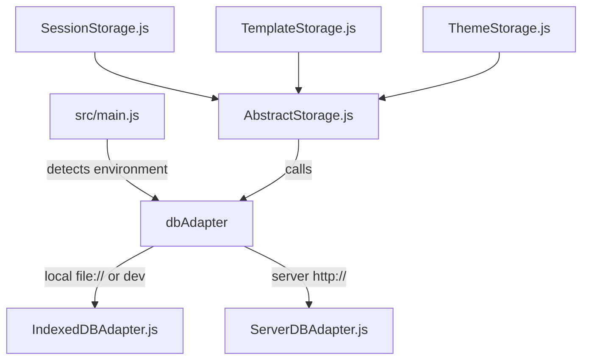

# Architecture

## 1. Storage Abstraction Layer

Miyapad is designed to run seamlessly as a fully self-contained local web app (storing data in the browser) or as a client connected to the Miyapad Node.js server. This is achieved via a pluggable database adapter interface:

- **`AbstractStorage` (`src/storage/AbstractStorage.js`)**: Base class that coordinates database requests. It implements a **500ms debounced save queue** (`enqueueSave`) to avoid excessive disk/DB writes during rapid user editing.
- **`IndexedDBAdapter` (`src/storage/IndexedDBAdapter.js`)**: Communicates with the browser's IndexedDB engine (Database `MiyaPad`, version 4). Handles database upgrades, persistence requests, exports, and imports.
- **`ServerDBAdapter` (`src/storage/ServerDBAdapter.js`)**: Converts database calls to HTTP POST requests hitting the Express server REST endpoints.
- **Named Storage Optimization**: To prevent massive performance degradation, session titles and metadata are indexed separately in a `names` table/store as a JSON object `{name, created, modified}`. This allows the dedicated Sessions Modal to quickly search, list, and sort sessions by creation or modification timestamps without pulling heavy compressed session history from the database.

## 2. Context APIs & State Management

- **`SettingsContext` (`src/contexts/SettingsContext.js`)**: Holds global settings and generation hyperparameters (e.g., Temperature, Top-K, Min-P, Mirostat, Dry Sampler options, selected model endpoints, OpenAI keys, instruction templates, active themes, TTS voice settings).
- **`GenerationContext` (`src/contexts/GenerationContext.js`)**: Manages runtime generation and prompt state (e.g., prompt text chunks, total token count, generation speed, active abort controllers, undo/redo stacks, open modal states, and UI view toggles).

## 3. Key Custom Hooks

- **`usePromptBuilder` (`src/hooks/usePromptBuilder.js`)**: Assembles the raw prompt injected into the LLM. It parses text, inserts instruct template tags (e.g. system messages, user instruction blocks, assistant headers), processes World Info (checking prompt text against regex keys), formats memory blocks, injects Author Notes at specified line depths, handles Fill-In-The-Middle (FIM) placeholders `{fill}` / `{predict}`, and converts conversational history to OpenAI-compatible messages.
- **`useGenerationLogic` (`src/hooks/useGenerationLogic.js`)**: Manages the core prediction loop. It calls API completion engines, streams tokens back to the UI chunk by chunk, calculates generation speeds (tokens/sec), manages cancellation/abort signals, manages undo/redo state histories, and passes completed generation blocks to the Text-To-Speech queue.
- **`useTTS` (`src/hooks/useTTS.js`)**: Interfaces with the Web Speech API to provide read-aloud capabilities for incoming tokens.
